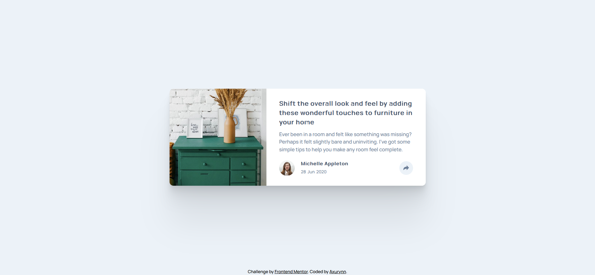
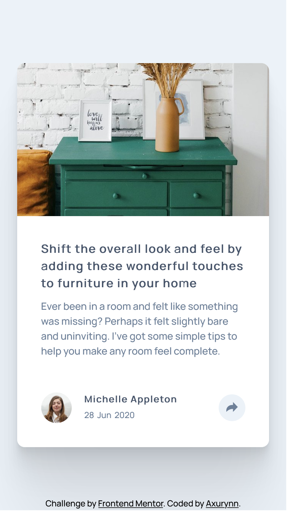

# Frontend Mentor - Article preview component

This is a solution to the [Article preview component challenge on Frontend Mentor](https://www.frontendmentor.io/challenges/article-preview-component-dYBN_pYFT). Frontend Mentor challenges help you improve your coding skills by building realistic projects.

## Table of contents

- [Frontend Mentor - Article preview component](#frontend-mentor---article-preview-component)
  - [Table of contents](#table-of-contents)
  - [Overview](#overview)
    - [The challenge](#the-challenge)
    - [Screenshots](#screenshots)
    - [Links](#links)
  - [My process](#my-process)
    - [Built with](#built-with)
  - [Author](#author)

## Overview

### The challenge

Users should be able to:

- View the optimal layout for the component depending on their device's screen size
- See the social media share links when they click the share icon

### Screenshots

Desktop screenshot

Mobile screenshot

### Links

- Solution URL: [article-preview-component](https://github.com/Axurynn/article-preview)
- Live solution: [article-preview-component_live](https://axurynn.github.io/article-preview/)

## My process

### Built with

- Semantic HTML5 markup
- SCSS custom properties
- Flexbox
- Mobile-first workflow

## Author

- Website - [Axurynn](https://axurynn.fr)
- Frontend Mentor - [@axurynn](https://www.frontendmentor.io/profile/axurynn)
- Twitter - [@Drc_Axu](https://www.twitter.com/Drc_Axu)
